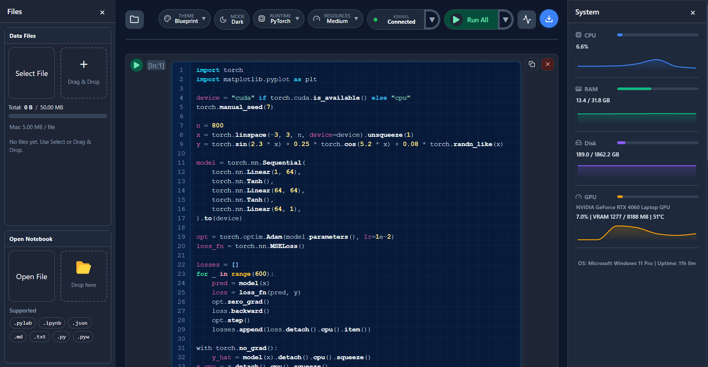
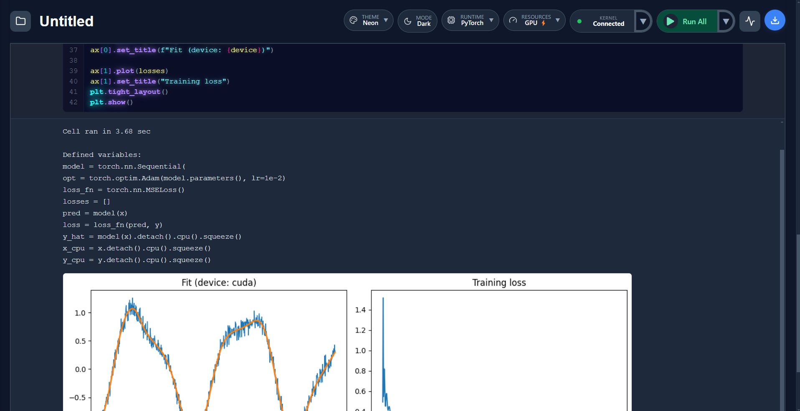
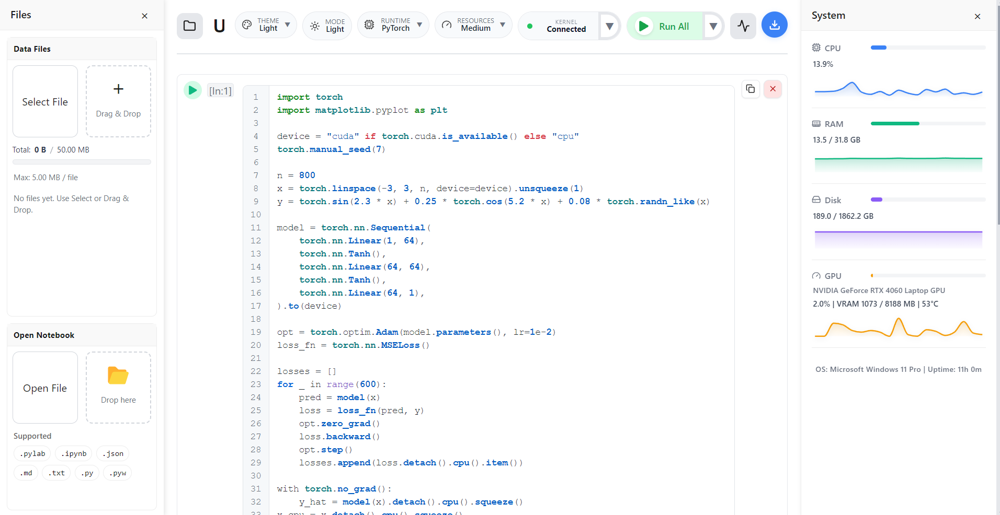
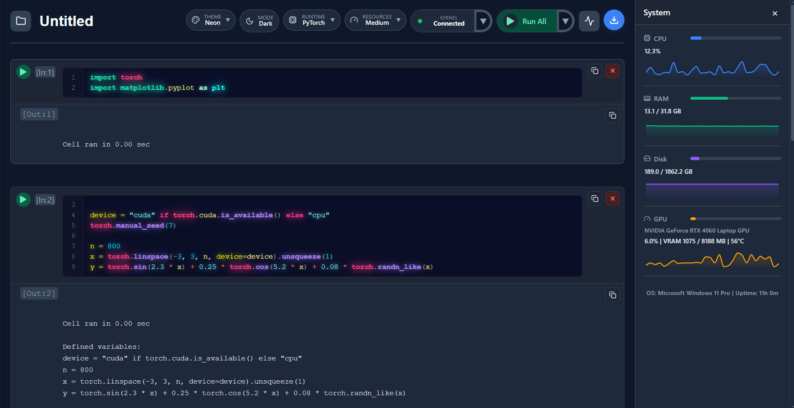
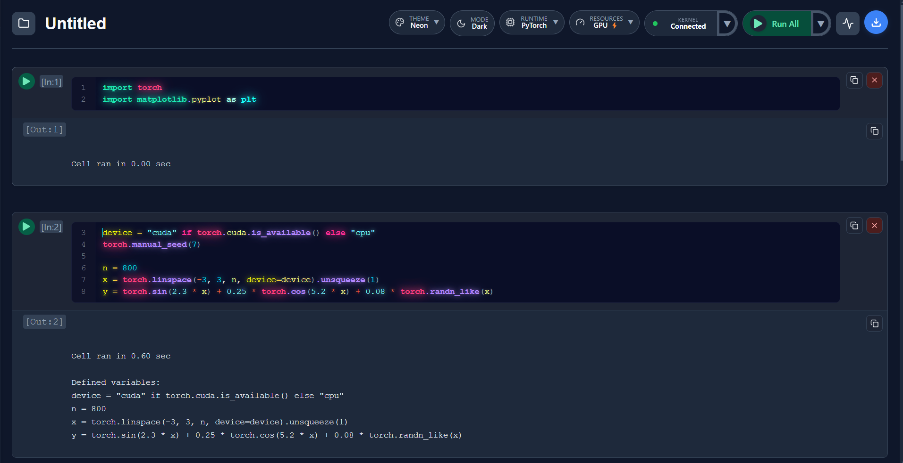
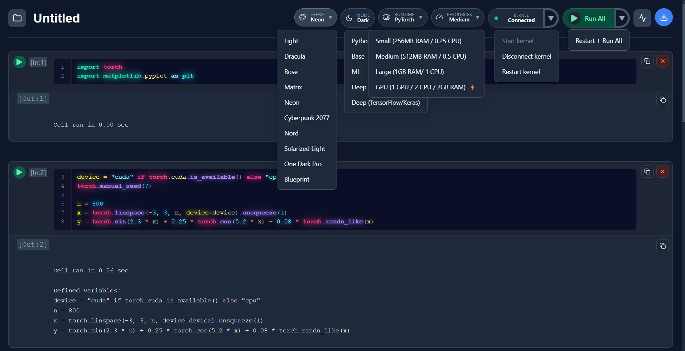

<h1 align="center">
   
  PyLab
</h1>

  <!-- Core stack -->
  

    
    
    
    
  

  <!-- Runtimes / ML stack -->
  

    
    
    
    
    
  

  <!-- Features -->
  

    
    
  

# A Modern Python Compiler and Notebook Runner for Desktop

 

Built for Python learners, data workflows, and machine learning experiments. Run locally with real time output, inline plots, and isolated runtimes.

Write code cells, add Markdown comments and images, upload data files, and choose a runtime  
**Python (3.11), Base, ML, Deep (PyTorch), or Deep (TensorFlow/Keras)** with a matching resource preset.  

Run a single cell or **Run All**; kernels stay alive between runs, output streams back in **real time via WebSockets**, and plots are captured automatically and shown inline.

New UI features include a **light/dark/Neon theme switcher**, **system stats panel** (CPU/RAM/GPU activity), an improved **runtime dropdown with deep-learning profiles**, and **open/download** actions for working with existing notebooks.

---

## Download

- 📦 Latest Release (repo): [pylab-installer](https://github.com/SKT1803/pylab-installer/releases/latest)
<!--  - ⬇️ Windows (.exe): [pylab-1.0.0.exe](https://github.com/SKT1803/pylab-installer/releases/latest/download/pylab-1.0.0.exe) -->
- 🌐 Download: [Download For Windows](https://pylab-desktop.vercel.app/)

---

## Live Demo

**Frontend/UI Demo**  
The live deployment currently includes **only the UI** — backend runtimes and Docker-based execution are not active in this environment.

You can explore the interface, create/edit notebooks, and see simulated execution outputs (Demo Mode), but actual code execution is **disabled**.

> 🌐 Live UI: [python-notebook-compiler](https://python-notebook-compiler.vercel.app)

---

## Previews

  

  

  

  

  

  

